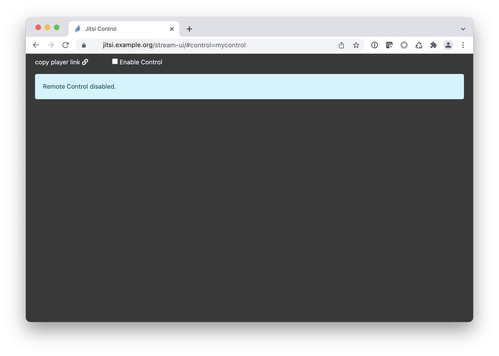
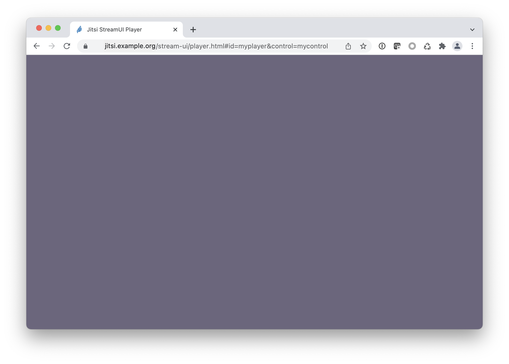
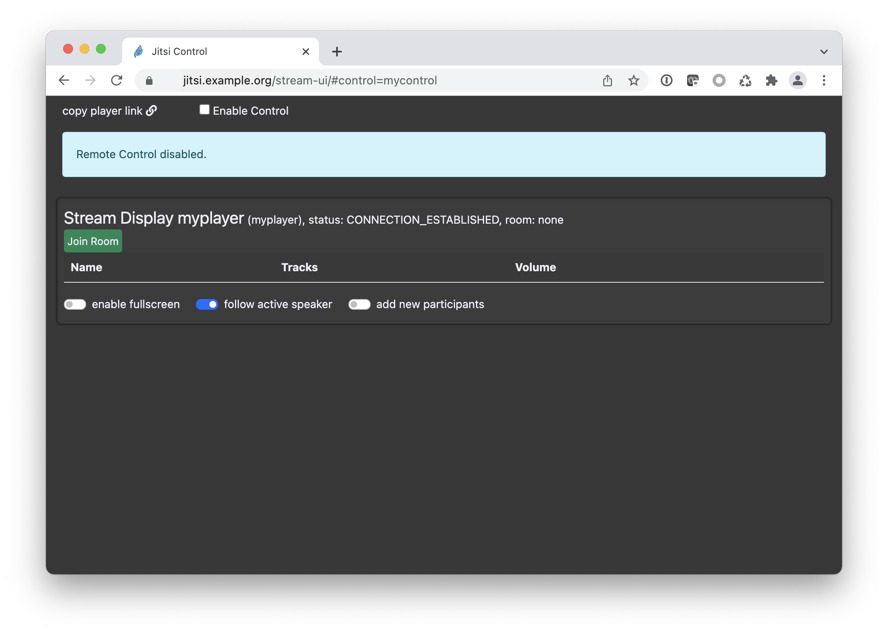
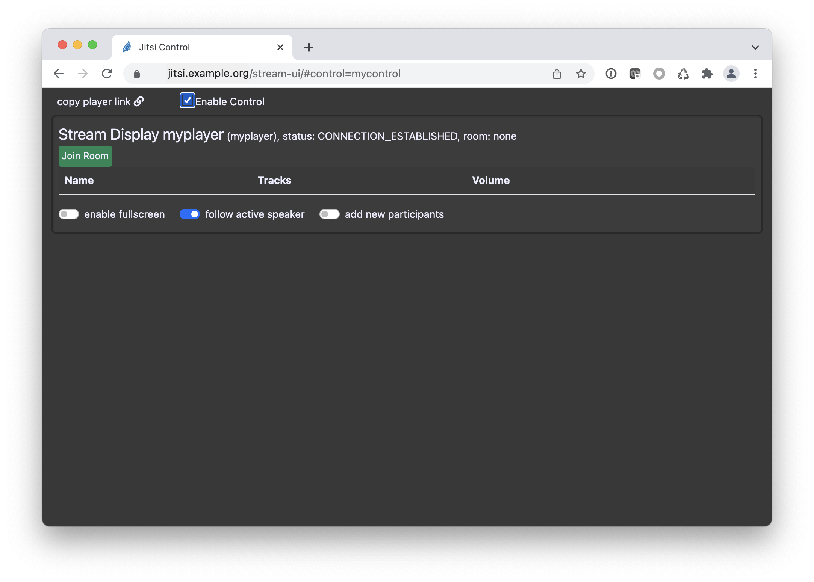
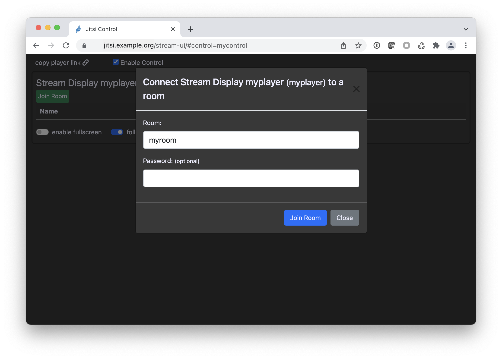
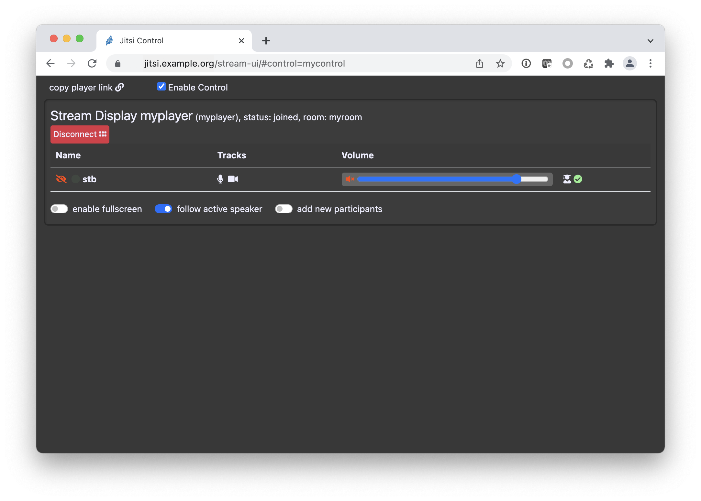

# Using jitis-stream-ui

In this document, sample URLs for Jitsi and jitsi-stream-ui are based on a hypothetical install on jitsi.example.org, where jitsi-stream-ui is running on the same host as the Jitsi install, below `/stream-ui/`.

## Starting the Control Room

Open the URL configured for jitsi-stream-ui in a browser: <https://jitsi.example.org/stream-ui/>. This will create a new control room instance.

If you want to create a room with a known ID, add the `control`parameter to the URL like so: <https://jitsi.example.org/stream-ui/#control=mycontrol>.

The control room will be empty initially.

## Adding a Player Window

In order for your video switcher to see the participants of the Jitsi conference, you will need one or more players. You can create the player URL yourself: <https://jitsi.example.org/stream-ui/player.html#control=mycontrol&id=myplayer>. If you want to get a new, random player, you can click "copy player link" in the upper left hand corner of the control room. jitsi-ui will copy the link to a new player window with a random player ID to the clipboard. Use that link in a new tab, or on the computer that you're feeding into your video mixer.

**Important**: In order for the player window to become fully functional, you need to click inside the tab once; otherwise, the browser will not allow video and audio to be played. Currently, stream-ui does not remind you to do that, and there is no feedback that you have successfully clicked, other than the video starting to play once you have assigned participants to this player.

The control room will list the player now.

**Important**: There is currently no safeguard against multiple players using the same ID. Having more than one player with the same ID will not cause problems in the players, but it will make the control room flicker as both rooms are constantly updating and overwriting the status. Try to avoid that!

## Enabling Control and Joining a Room

When you first open the control room, you are in a view only mode: you cannot make any changes to the setup. This is to avoid accidents if multiple people are working on the same production, and want to monitor what the current setup is. Click "enable remote control" at the top of the window to allow yourself to make changes in the control room.

Next, you need to join the player to a running Jitsi conference room. Note that the name of the control room and the name of the Jitsi room are completely independent of each other. In fact, if you have multiple players, they can be joined to different Jitsi conferences each.

Once the player has joined the room, a list of participants is shown for that player in the control room.

## Showing A Participant in the Player

By default, all participants are invisible and muted in the player. In order to show and hear one or more participants, you need to:

-   Unmute the participant by clicking the red crossed-out speaker icon in the Volume column;
-   Make the participant visible by clicking the red crossed-out eye icon in the Name column.

If you want to show the participants in full screen, i. e. one participant at a time, without any background or borders, you need to select the participant to start with by clicking their name. The name will then be shown in all caps, and the "enable fullscreen" switch will turn on.

# Control Room Player Controls Reference

For each player the control room offers status display and controls.

**The header** shows the name of the player (as given by the `id` parameter in the URL), the status and which room the player is joined to (if joined).

**For each participant**, the status is shown and a number of controls are available:

| Info     | Description                                                                                                                                                                                                                                              |
| -------- | -------------------------------------------------------------------------------------------------------------------------------------------------------------------------------------------------------------------------------------------------------- |
| Eye icon | This participant is visible (green eye) or not visible (red crossed-out eye) in the player. Clicking the icon will switch visibility on or off.                                                                                                          |
| Dot      | The participant is currently speaking (green dot).                                                                                                                                                                                                        |
| Name     | The participants name. If the name is displayed in all caps, this participant is in full-screen mode. Clicking the name will take this participant into full screen mode.                                                                                |
| Tracks   | A microphone and a camera icon indicate whether this participant is sending audio and/or video.                                                                                                                                                           |
| Volume   | A volume slider allows you to control the level of the audio received from this participant. A white speaker icon indicates the participant is unmuted, a red crossed-out speaker icon that they are muted; clicking it mutes or unmutes the participant. |
| Person   | _To be documented_                                                                                                                                                                                                                                       |

Below the list of participants are **a number of controls**:

-   "enable fullscreen" switches the layout from the superview of (potentially) multiple participants to fullscreen, where only a single participant is visible at any given time.
-   "follow active speaker" will switch to the currently active speaker whenever it changes. This makes the most sense with fullscreen mode.
-   "add new participants": when this option is enabled, new participants joining the Jitsi room are automatically shown in the player. When this option is off, participants start off muted and invisible; to have them appear in the player, you need to unmute them and view them (see above)
